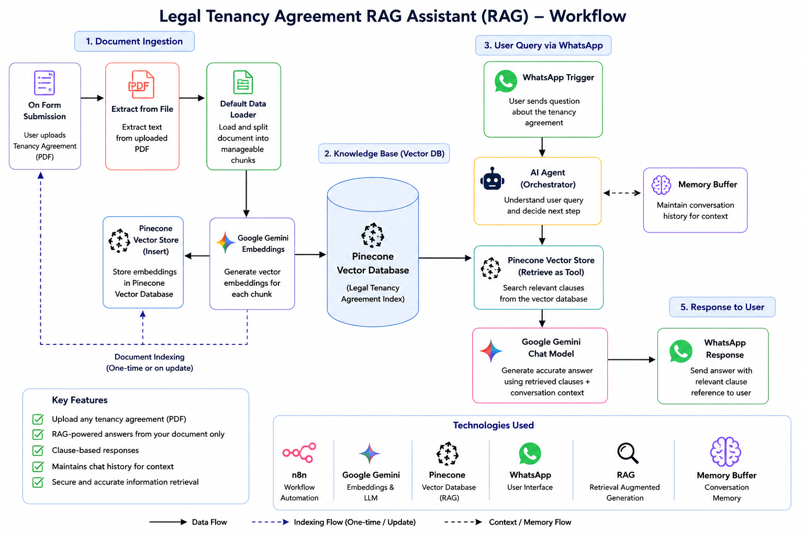

# ⚖️ Legal Tenancy Agreement RAG Assistant

AI-powered WhatsApp assistant that uses **Retrieval-Augmented Generation (RAG)** to answer questions from uploaded tenancy agreements and provide relevant clause-based information.

## 🚀 What This Workflow Does

This workflow allows users to upload a tenancy agreement and ask questions about their lease through WhatsApp.

The system processes the uploaded agreement, converts it into searchable knowledge, and uses an AI Agent with **Pinecone Vector Database** to retrieve relevant clauses before generating an answer.

The assistant is designed to answer only from the uploaded tenancy agreement and avoid generating unsupported legal information.

## ⚙️ Workflow

### Workflow Steps

1. **Upload Tenancy Agreement**
   - User uploads a tenancy agreement in PDF format.

2. **Extract PDF Content**
   - The document is processed and its text is extracted.

3. **Document Processing**
   - Extracted content is prepared for vector-based retrieval.

4. **Generate Embeddings**
   - Google Gemini Embeddings convert the document content into vector representations.

5. **Store in Pinecone**
   - Document embeddings are stored in a Pinecone Vector Database.

6. **User Query via WhatsApp**
   - The user asks a question about the tenancy agreement through WhatsApp.

7. **AI Agent**
   - The AI Agent receives the user's question and searches the tenancy agreement knowledge base.

8. **RAG Retrieval**
   - Pinecone retrieves the most relevant sections or clauses from the agreement.

9. **Generate Grounded Response**
   - Google Gemini generates an answer based on the retrieved agreement content.

10. **WhatsApp Response**
    - The answer is automatically sent back to the user through WhatsApp.

## 🎯 Key Features

- 📄 PDF tenancy agreement processing
- 🔎 Retrieval-Augmented Generation (RAG)
- ⚖️ Clause-based document Q&A
- 🧠 AI-powered contextual responses
- 🗄️ Pinecone Vector Database
- 💬 WhatsApp integration
- 🛡️ Knowledge-grounded responses
- 🚫 Prevents unsupported legal information from being generated
- 🔗 Relevant clause references whenever possible

## 💡 Example Use Cases

Users can ask questions such as:

- What is the monthly rent?
- What is the lease duration?
- What are the tenant's responsibilities?
- What are the termination conditions?
- Is there a security deposit?
- What does the agreement say about maintenance?
- Which clause covers early termination?

The assistant searches the uploaded tenancy agreement and provides an answer based on the available document content.

## 🧰 Tech Stack

- **n8n** – Workflow Automation
- **Google Gemini** – AI & Embeddings
- **Pinecone** – Vector Database
- **WhatsApp** – User Interaction
- **RAG** – Knowledge Retrieval
- **AI Agent** – Query Processing
- **PDF Document Processing** – Agreement Extraction

## 🛠️ Skills Demonstrated

- AI Workflow Automation
- Retrieval-Augmented Generation (RAG)
- AI Agent Development
- Vector Database Integration
- Document Processing
- Prompt Engineering
- WhatsApp API Integration
- n8n Workflow Design
- Knowledge-Grounded AI Systems
- API & AI Tool Integration

## 🚀 Project Implementation

This project demonstrates how tenancy agreements can be processed using **RAG** to provide clause-based answers to user questions through WhatsApp.

A sanitized n8n workflow file is included for portfolio demonstration.

👉 [View / Download Workflow JSON](Legal_Tenancy_Agreement_RAG.json)

For custom implementation or commercial use, please **Contact Us**:
 

## 👨‍💻 Author

Faheem Abbas

AI Automation Specialist | n8n Expert | AI Agents | AI-Powered Business Automation | Lead Generation | API Integrations | WhatsApp Automation | RAG

**#AI #AIAutomation #n8n #RAG #GoogleGemini #Pinecone #WhatsAppAutomation #AIAgents #WorkflowAutomation #AIEngineering #bluemoonways**
